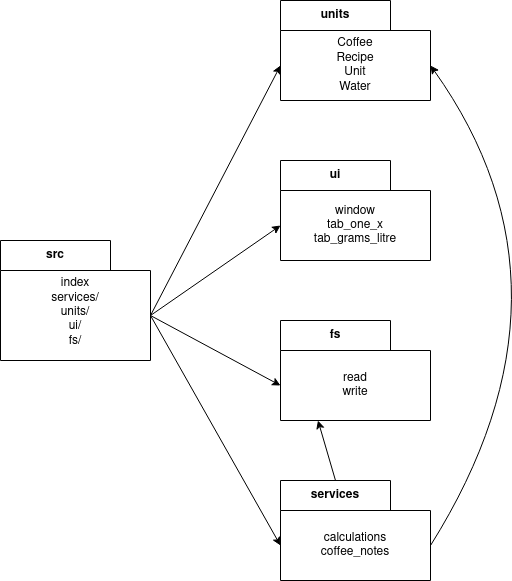
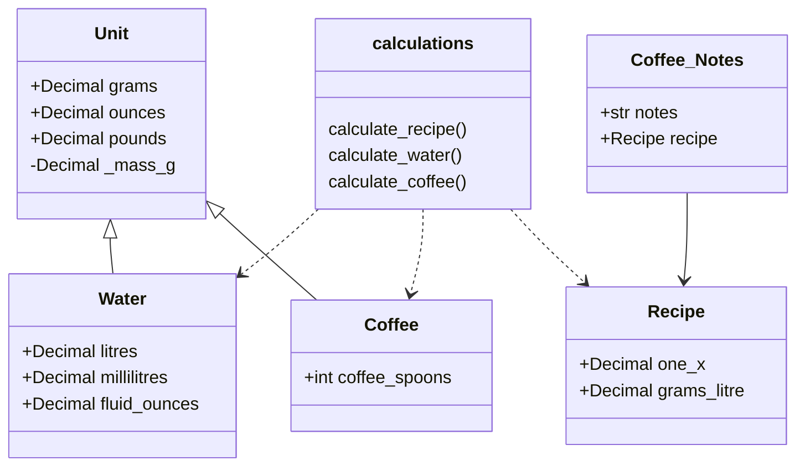
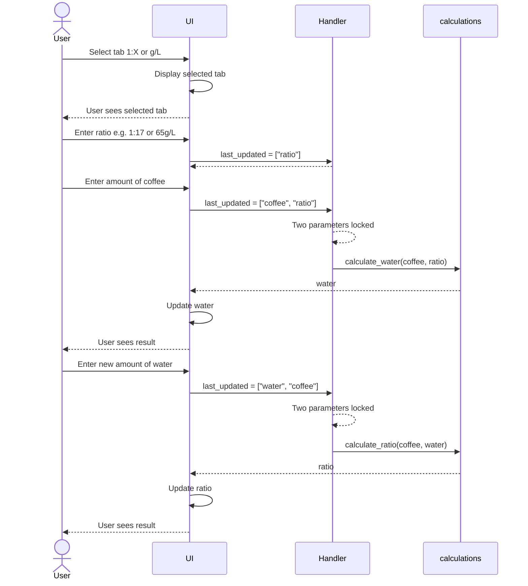

# Software architecture description

## Packaging

Package _ui/_ provides UI functions, _services/_ provides core program logic, _fs/_ provides filesystem interaction, and _units/_ provides unit conversions and classes.

## Classes

## Sequence diagram
Here is an example sequence of a user first calculating water for given amount of beans and given ratio, then tweaking amount of water to calculate new ratio.

As User inputs values, handlers are called to determine which parameters should be "locked in" per user input, and which parameter should be dynamically calculated.