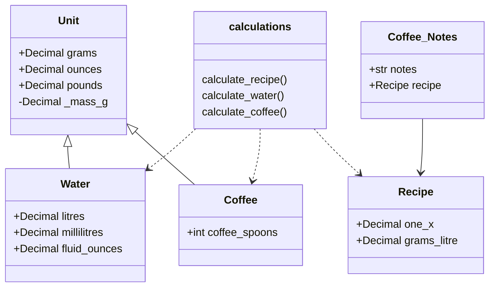

# Software architecture description

## Packaging

Package _ui/_ provides UI functions, _services/_ provides core program logic, _fs/_ provides filesystem interaction, and _units/_ provides unit conversions and classes.

## Classes

