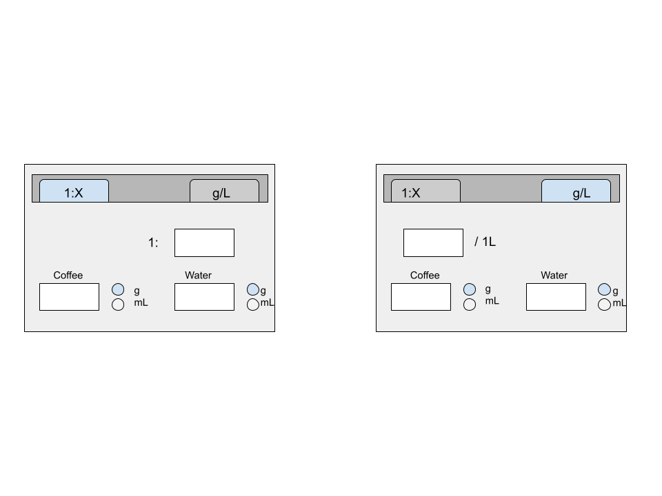

# Software Requirements Specification

## Purpose

_ratio_ is an application for calculating dosages and recipes for brewing coffee.
The user can enter either the desired amount of coffee to use, the desired volume of brewed coffee, or the desired strength.

## UI Draft

The application has a tabbed one-window model with two tabs:

## Planned functionality

- The user enters two variables and the application dynamically calculates the third variable
  - Calculate the amount of coffee needed to brew a certain volume at a certain strength - done ✅
  - Calculate the amount of water needed to brew a certain volume of coffee beans at a certain strength - done ✅
  - Calculate the strength of a recipe for a given amount of coffee and water - done ✅
- The user has a selection of mass and volume units to use for coffee or water variable - done✅
- Desired strength can be entered in units of g/L or 1:X - done ✅
- The user can save and open recipes - done ✅
  - User can also note down the beans used for the recipe and other potentially relevant information such as grind size and taste notes
