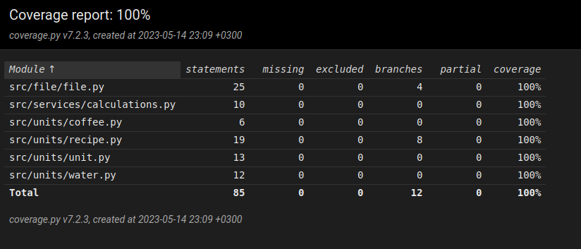

# Testing document

The application has gone through both automated unit testing and manual usage testing.

## Unit testing

### Program logic

Program logic is tested through the following files and classes:
- `calculations_test.py` - TestCalculations
- `units/coffee_test.py` - TestCoffee
- `units/recipe_test.py` - TestRecipe
- `units/unit_test.py` - TestUnit
- `units/water_test.py`. - TestWater

### Data storage

Data storage is tested using `file/file_test.py`'s TestFile class. The tests generate files `ratio.test` and `ratio.notwritable`, which are removed in the test's `tearDown()`.

### Test coverage

Test coverage, not including UI code and `index.py`, is 100%.

## Usage testing

Usage testing has been performed manually.

### Installation

Installation has been tested on macOS and Cubbli Linux by following the [User guide](https://github.com/jobatabs/ratio/blob/main/doc/usage.md).

### Functionality

All completed functionality outlined in the [Software Requirements Specification](https://github.com/jobatabs/ratio/blob/main/doc/software_requirements_specification.md) has been tested to exist.

## Current issues

The UI does not use the program logic classes to dynamically calculate recipe values, and as such is as-of-yet unused.