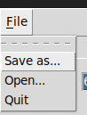

# User guide

## Installation

1. Download the repository.
2. Install poetry.
3. Install dependencies using poetry: ```poetry install```
4. Run the program: ```poetry run invoke start```

## Usage

The program has two tabs. Both tabs allow you to enter desired amounts of coffee and water, and select desired units for them.

The 1:X tab allows you to enter a desired brew strength in the format of 1 gram of coffee : X grams of water.


the g/L tab allows you to enter a desired brew strength in the format of x grams of coffee / 1 litre of water.


You can save a permanent copy of your current recipe into a file from the File menu. From here you can also open a file to recall saved values.

