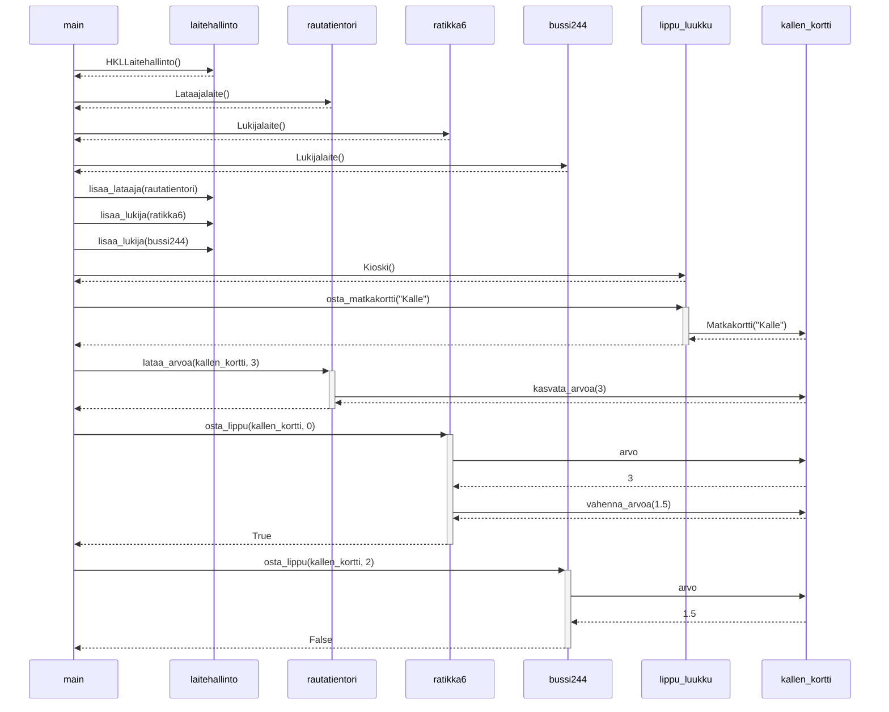

```mermaid
  sequenceDiagram
      main->>laitehallinto: HKLLaitehallinto()
      laitehallinto-->>main: 
      main->>rautatientori: Lataajalaite()
      rautatientori-->>main: 
      main->>ratikka6: Lukijalaite()
      ratikka6-->>main: 
      main->>bussi244: Lukijalaite()
      bussi244-->>main: 
      main->>laitehallinto: lisaa_lataaja(rautatientori)
      main->>laitehallinto: lisaa_lukija(ratikka6)
      main->>laitehallinto: lisaa_lukija(bussi244)
      main->>lippu_luukku: Kioski()
      lippu_luukku-->>main: 
      main->>+lippu_luukku: osta_matkakortti("Kalle")
      lippu_luukku->>kallen_kortti: Matkakortti("Kalle")
      kallen_kortti-->>lippu_luukku: 
      lippu_luukku-->>-main: 
      main->>+rautatientori: lataa_arvoa(kallen_kortti, 3)
      rautatientori->>kallen_kortti: kasvata_arvoa(3)
      kallen_kortti-->>rautatientori: 
      rautatientori-->>-main: 
      main->>+ratikka6: osta_lippu(kallen_kortti, 0)
      ratikka6->>kallen_kortti: arvo
      kallen_kortti-->>ratikka6: 3
      ratikka6->>kallen_kortti: vahenna_arvoa(1.5)
      kallen_kortti-->>ratikka6: 
      ratikka6-->>-main: True
      main->>+bussi244: osta_lippu(kallen_kortti, 2)
      bussi244->>kallen_kortti: arvo
      kallen_kortti-->>bussi244: 1.5
      bussi244-->>-main: False
```