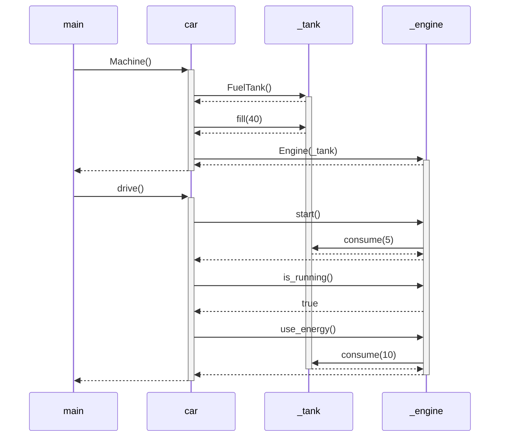

```mermaid
  sequenceDiagram
      main->>+car: Machine()
      car->>+_tank: FuelTank()
      _tank-->>car: 
      car->>_tank: fill(40)
      _tank-->>car: 
      car->>+_engine: Engine(_tank)
      _engine-->>car: 
      car-->>-main: 
      main->>+car: drive()
      car->>_engine: start()
      _engine->>_tank: consume(5)
      _tank-->>_engine: 
      _engine-->>car: 
      car->>_engine: is_running()
      _engine-->>car: true
      car->>_engine: use_energy()
      _engine->>_tank: consume(10)
      _tank-->>-_engine: 
      _engine-->>-car: 
      car-->>-main: 
```