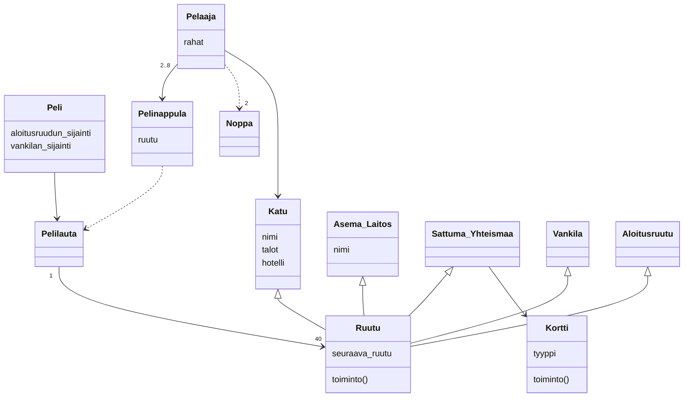

```mermaid
  classDiagram
      Peli --> Pelilauta
      class Peli {
        aloitusruudun_sijainti
        vankilan_sijainti
      }
      Pelilauta "1" --> "40" Ruutu
      Pelaaja "2..8" --> Pelinappula
      Pelaaja ..> "2" Noppa
      Pelinappula ..> Pelilauta
      class Pelinappula {
        ruutu
      }
      class Pelaaja {
        rahat
      }
      Pelaaja --> Katu
      class Katu {
        nimi
        talot
        hotelli
      }
      class Ruutu {
        seuraava_ruutu
        toiminto()
      }
      class Asema_Laitos {
        nimi
      }
      Katu <|-- Ruutu
      Sattuma_Yhteismaa <|-- Ruutu
      Vankila <|-- Ruutu
      Aloitusruutu <|-- Ruutu
      Asema_Laitos <|-- Ruutu
      Sattuma_Yhteismaa --> Kortti
      class Kortti {
        tyyppi
        toiminto()
      }
```